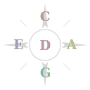

<p align="center">
  
</p>

# CAGED Explorer

An interactive fretboard visualization tool for exploring the CAGED guitar chord system. Built with React and SVG.

## What it does

CAGED Explorer lets you visualize how the five CAGED chord shapes (C, A, G, E, D) tile across the fretboard in any key, for both major and minor tonalities. It shows:

- **Chord shapes** — open chord fingerings and their barre chord positions across the neck
- **Triads** — major and minor triad tones within each shape
- **Pentatonic scales** — major and minor pentatonic box patterns, with optional blues notes
- **Frying pan overlay** — highlights 5-note pentatonic groups across string pairs, showing how shapes connect horizontally
- **Shape hover regions** — in "All" mode, hover over fretboard regions to see where each shape lives

All views support both major and minor keys across all 12 roots, with note labels showing intervals, note names, or both. Light and dark themes are available, with OS preference detection.

## Getting started

```bash
npm install
npm run dev
```

Open http://localhost:5173.

## Scripts

| Command | Description |
|---------|-------------|
| `npm run dev` | Start dev server with HMR |
| `npm run build` | Production build to `dist/` |
| `npm run lint` | Run ESLint |
| `npm test` | Run test suite |

## Tech stack

- React 19
- Vite (rolldown variant)
- Vitest
- SVG (inline, no charting library)
- No CSS framework — inline styles throughout

## Architecture

The codebase is split into two main files:

- `src/music.js` — pure functions and static data tables for music theory (pentatonic boxes, triad shapes, fret ranges, note shifting)
- `src/App.jsx` — React components, UI state, and SVG rendering

All fretboard note positions are defined at `effectiveKey=0` with two octaves of coverage, then shifted at runtime to the selected key. This keeps the data tables simple and the rendering logic uniform.

See `CLAUDE.md` for detailed architecture notes.

## License

[MIT](LICENSE)
